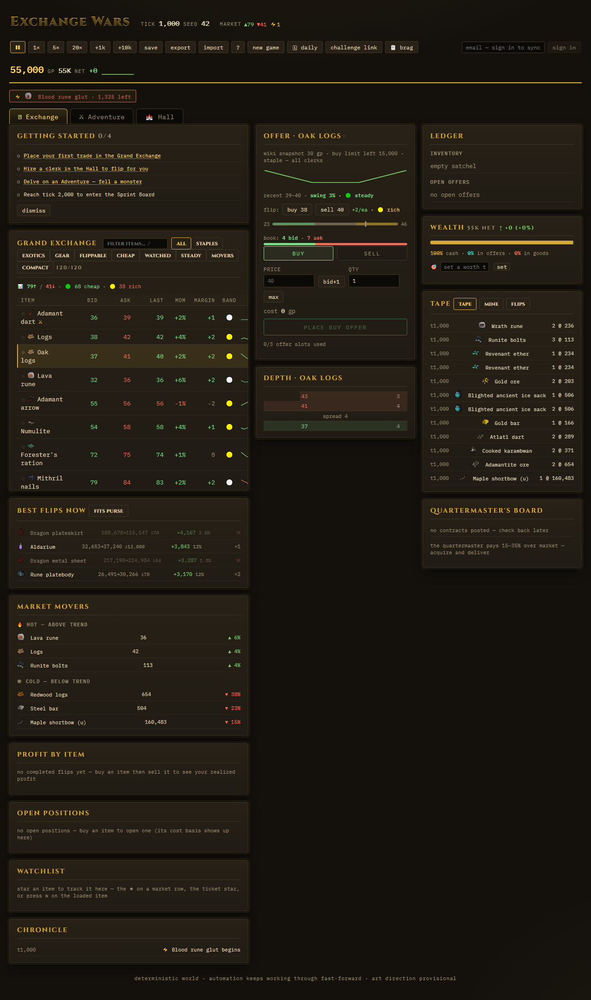
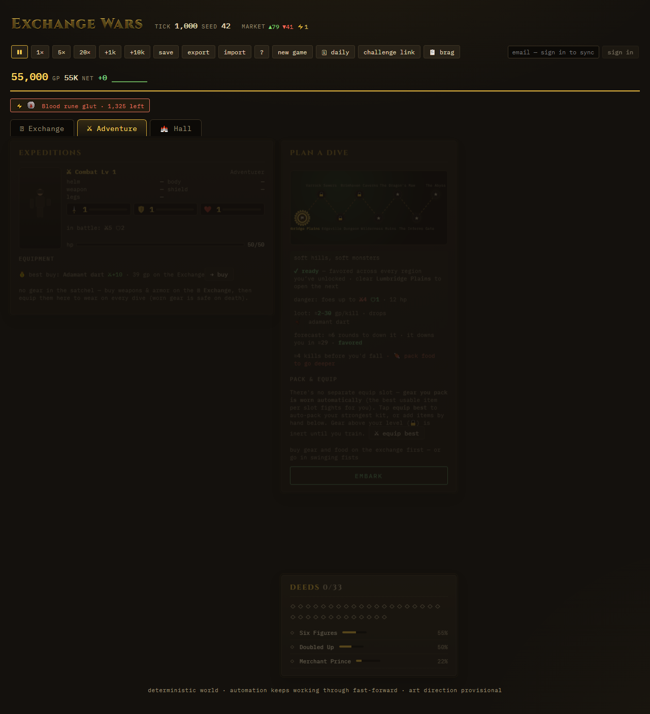
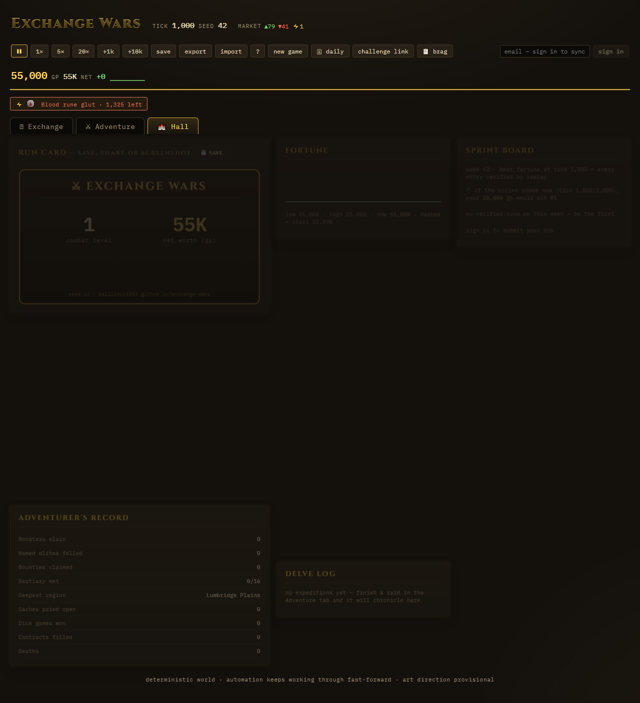

# Exchange Wars

**▶ Play it: https://kalilinux1993.github.io/exchange-wars/**



The trading floor is one of three rooms — **Adventure** sends raiding parties into eight regions, and the **Hall** holds your fortune, the leaderboard, and your record:




A market/trading tycoon game built on a fully deterministic, headless economy simulation. NPC agents — producers, consumers, market makers, momentum chasers, noise traders — trade items on a GE-style exchange with limit order books, escrow, and a 2% sell tax. The player flips items, corners markets, and (in later phases) unlocks automation.

The defining constraint: **the entire game core is testable and debuggable with zero human in the loop.** Same seed → same world, bit for bit. A scripted flipper bot plays the game programmatically from day one.

## What's in the game

- **120 real OSRS items** (names, price scales, icons snapshotted from the wiki) trading on GE-style limit order books with escrow and a 2% sell tax — staples for steady flipping, high-priced exotics for the brave
- **A living economy**: producers, consumers, market makers, momentum and noise traders — plus ⚡ **world events** (shortages, crazes, gluts, slumps) and a **Chronicle** of their history
- **Trader's cockpit**: filterable/sortable market, clickable depth ladder, offer ticket with max/limit awareness, personal fill log, fortune chart
- **Progression**: GE offer slots (3→8), a hireable **auto-flipping clerk** with three tiers and configurable orders (risk / capital / focus), real **GE buy limits**, quartermaster **delivery contracts**, and a book of Deeds spanning trading and adventuring
- **True idle game**: the world advances ~1 tick per real second while the tab is closed (≈28h cap); installable PWA; save export/import; optional email sign-in for cross-device cloud saves
- **Challenge seeds, ghosts & sharing**: the same seed always produces the identical world — send a friend a `#seed=` challenge link, share a one-tap **run brag** (your stats + that link, via the native share sheet on mobile), or restart your own seed and race your best previous run as a chart ghost
- **Expeditions (RPG layer)**: outfit an adventurer with gear and food bought on the exchange and delve an **eight-region node graph**, Lumbridge Plains to The Abyss. Every step and combat round costs a market tick — time raiding is time not trading. Drops mint through the same audited conservation ledger as everything else; death keeps your 3 most valuable carried items (5 with a Death Ward) and **wounds persist** (mend slowly at home, or eat in the field)
- **Combat training**: Attack grows from damage dealt and gates weapons; Defence from damage taken and gates armor; Hitpoints raise your max hp. A 20-item gear ladder (darts → staff → mystic → rune → dragon) where carried gear above your level is inert — and past the Wilderness everything **breathes fire**: armor won't stop it, a super antifire potion will, one per dive
- **The dark between fights**: shrines, goblin dice, imp chases, depth-skipping portals and overpriced merchants; four named elites (Skarn, Vorkanth, Zukrath, Vessith) guarding the deep ends; a **Bestiary** that reveals kill counts and drop tables monster by monster as you meet them
- **Honest scoring**: your net worth is *liquidation value* — what the resting order books would actually pay for everything you hold right now, not a fantasy mark. One-click **sell @ bid** realizes it
- **Verified leaderboards**: submit your best fortune at tick 2,000 — the server replays your entire command log through the same deterministic engine and posts the worth *it* computed, deepest-region badge included. Determinism is the anti-cheat; a forged score cannot reproduce

## Quick start

```sh
npm install
npm test                                   # all gates: unit, determinism, conservation, market sanity, purity
npm run sim -- --seed 42 --ticks 10000     # fast-forward an economy, print the report
npm run sim -- --seed 42 --ticks 10000 --report-every 2000
```

## Architecture (npm workspaces)

```
packages/
├── engine/                @exchange-wars/engine — pure simulation, no I/O/clock/Math.random
│   ├── src/               (purity enforced by packages/engine/test/purity.test.ts)
│   │   ├── index.ts       public API barrel — the only entry other packages may import
│   │   ├── rng.ts         mulberry32, RNG cursor stored in world state
│   │   ├── types.ts       plain-JSON world state (round-trips losslessly)
│   │   ├── exchange.ts    limit order book: price-time priority, partial fills, escrow, 2% tax burn
│   │   ├── agents.ts      NPC archetypes + flipper strategy core; ALL balance numbers in TUNING
│   │   ├── commands.ts    the player surface: applyCommand / playerView / PROGRESSION
│   │   ├── quest.ts       the RPG core: regions, monsters, gear ladder, stats/xp, combat
│   │   ├── replay.ts      sprint verifier: record → replay → identical world (anti-cheat)
│   │   ├── sim.ts         world creation + tick loop
│   │   ├── invariants.ts  conservation checker (gp/items vs explicit mint/burn ledger)
│   │   ├── hash.ts        canonical-JSON FNV-1a state hash
│   │   ├── report.ts      economy report / net-worth helpers
│   │   ├── harness.ts     balance measurement helpers (shared by CLI + gate)
│   │   └── catalog.ts     default item set
│   └── test/              the gates (19 suites) — see DEV_GUIDE.md
├── ui/                    @exchange-wars/ui — THE GAME: React + Vite + TS over the engine (mutates only via applyCommand)
│   ├── src/               App.tsx · game.ts (pure UI helpers — flips, value bands, P&L, forecasts) · components/ (trading cockpit + OSRS HUD) · cloud.ts (Supabase saves/leaderboard) · usePref.ts
│   └── test/              app.test.tsx (450+ cases) + e2e/ (Playwright)
└── cli/                   @exchange-wars/cli
    └── src/               run.ts (sim runner) · balance.ts (tier-curve matrix)
```

`packages/ui` (Phase 4+, shipped) is the deployed game at the link above. Cloud saves and verified leaderboards currently ride a Supabase backend (`packages/ui/src/cloud.ts` + a `verify-score` edge function that replays your command log) rather than a bespoke `packages/server`.

## Economy design

- **Price floor:** producers mint items at a cost anchor and never sell below cost×1.05.
- **Price ceiling:** consumers earn wages (gp faucet), burn items (item sink), and never bid above reservation value.
- **gp sink:** 2% tax on every sale, burned to the ledger. **Conservation is provable:** in-world gp == initial + minted − burned, always (see `checkInvariants`).
- **Liquidity:** market makers quote both sides around the EMA; momentum/noise traders create the dislocations the flipper profits from.

## Data & credits

Item names, price scales, and icons are a **build-time snapshot** of real Old School RuneScape Grand Exchange data from the [OSRS Wiki prices API](https://prices.runescape.wiki) (regenerate with `npm run gen:catalog` — then re-run the balance sweep + gates). Icons and item data are from the OSRS Wiki; RuneScape is a trademark of Jagex Ltd. This is a free fan project, unaffiliated with Jagex. The simulation itself is fully deterministic — no live data flows into the engine.

**Game art** (HUD icons, monster/skill art) is sourced under open-licensed terms only — see [CREDITS.md](CREDITS.md). Drop SVGs into `packages/ui/src/assets/icons/` (naming + license rules in that folder's README); the `Icon` loader auto-discovers them and falls back to emoji until then. No Jagex/OSRS sprites or CC BY-NC-SA Wiki art are used.

## Determinism rules (hard constraints)

1. No `Date.now` / `Math.random` / `performance.now` / `new Date` / timers in `packages/engine/src` — gated by `packages/engine/test/purity.test.ts`.
2. All randomness from the seeded RNG whose cursor lives in `WorldState.rngState`.
3. World state is plain JSON: no classes, functions, Map/Set, or `undefined` properties. `JSON.parse(JSON.stringify(state))` must resume identically — gated by `packages/engine/test/determinism.test.ts`.
4. gp is integer-only; totals are `Number.isSafeInteger`-checked in invariants.
5. Iteration over Records follows `state.items` order or sorted keys — never raw insertion order.
